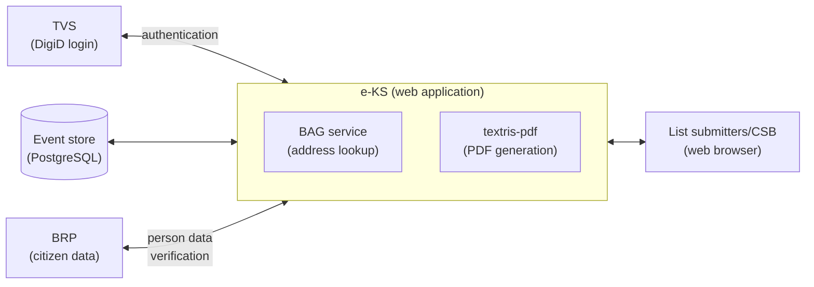

# e-KS code architecture

## Summary

e-KS is a server-side rendered Rust web application that helps a political
group assemble all the documents needed to submit a candidate list for a
specific election. The application guides the user through the nomination
procedure: it validates the data that is entered and generates the correct,
officially formatted documents (the H-models) from that data.

Each "account" is scoped to a single user, who logs in via TVS / DigiD. That
scoping lets the application persist a user's work throughout the nomination
period, so the candidate list can be built up over multiple sessions before it
is submitted.

The application serves two kinds of users, in two sections of the code. The
**political group side** (`src/pg/`) is where a political group assembles,
validates, and exports its submission. The **CSB side** (`src/csb/`) is where
the central voting bureau (*centraal stembureau*) imports a submitted package
and examines it, records omissions (*verzuimen*) and corrections, following
Hoofdstuk I of the Kieswet (see [The CSB section](#the-csb-section-srccsb)).

### High-level overview


## Domain glossary

The code, the routes, and the `src/pg/<domain>/` folders all use the terms
below. Each has an established Dutch name from the Kieswet (the Dutch electoral
law); the English term is what the code uses. Article references are to
Hoofdstuk H of the Kieswet (*De inlevering van de kandidatenlijsten*) unless
noted otherwise.

| Term (code) | Dutch | Kieswet | Role in the process |
|-------------|-------|---------|---------------------|
| Political group | Politieke groepering | Art. G 1 | The political group taking part in the election. It has a registered name (the *aanduiding*), registered with the central electoral committee under Hoofdstuk G, that may be printed above its list. Modelled by `political_groups`. |
| Candidate list | Kandidatenlijst | Art. H 1 | The ordered list of candidates a political group submits for one or more electoral districts. This is the central artifact of the procedure and is filed as model **H1** (the form's model is fixed under Art. H 1, derde lid). Modelled by `candidate_lists`. |
| Candidate | Kandidaat | Art. H 6, H 9 | An electable person on a candidate list, at a specific position (ordering: Art. H 6). Each candidate provides a consent declaration, model **H9** (*instemmingsverklaring*, Art. H 9). Modelled by `candidates`. |
| Person | Persoon | n/a | A natural person record (personal data, address). A code-level abstraction, not a Kieswet term. A single person can be a candidate on multiple lists. Modelled by `persons`. |
| Electoral district | Kieskring | Art. H 2 | The geographic district a candidate list is submitted for; the list states which kieskring(en) it is filed for. A list is scoped to one or more districts. |
| List submitter | Lijstinleveraar | Art. H 3, eerste lid | The voter who hands in the candidate list to the central electoral committee in person. The notice of defects (*verzuimbrief*) is sent to this person's address. Modelled by `list_submitters`. |
| Substitute list submitter | Vervanger (voor het herstel van verzuimen) | Art. H 5 (Art. I 2) | One or more persons named on the list who, if the submitter is unavailable, may correct mistakes (*verzuimen*) on the list on the submitter's behalf (the *verzuimherstel* itself: Art. I 2). Modelled by `substitute_list_submitters`. |
| Authorised agent | Gemachtigde | Art. H 3, tweede/derde lid (Art. G 1, derde lid) | The political group's agent, registered with the central electoral committee under Hoofdstuk G, who authorises placing the political group's name above the list. This authorisation is filed as model **H3-1** (or **H3-2** for a combined name). Modelled by `authorised_agents`. |
| Representative | Gemachtigde van kandidaat | Art. H 10, H 10a | For a candidate residing outside the European part of the Netherlands: a representative, named in the candidate's consent declaration, who receives official correspondence (such as the appointment letter) on the candidate's behalf. Stored in the `persons`/`candidates` data. |
| Support declaration | Ondersteuningsverklaring | Art. H 4 | A declaration of support for a list, model **H4**, required in certain cases. |
| Central voting bureau | Centraal stembureau (CSB) | Art. I 1 | The electoral committee that receives the submitted candidate lists and examines them in a session on nomination day. The `src/csb/` section serves its members. |
| Omission | Verzuim | Art. I 1, I 2 | A defect the CSB finds when examining a submitted list. Recoverable omissions are notified to the list submitter with model **I 4** and may be repaired during the *herstel* period (Art. I 2). Modelled by `Omission` in the CSB store. |
| List designation | Lijstaanduiding | Art. G 1, H 3 | How the list is presented above the candidates: with the group's registered name (standalone), without one (a *blanco lijst*), or with a combined name. Modelled by `ListDesignation`. |

Both an "authorised agent" and a candidate's "representative" are a *gemachtigde*
in Dutch, but they are distinct roles: the authorised agent acts for the
political group's name (H3-1, Art. H 3), the representative acts for an individual
candidate living outside the Netherlands (Art. H 10).

The **H-models** are the official forms; each is named after the Kieswet article
that requires it and whose model is fixed by ministerial regulation: H1 (Art.
H 1), H3-1 / H3-2 (Art. H 3, vijfde lid), H4 (Art. H 4, zevende lid), H9 (Art.
H 9, vierde lid).

The `finalise` domain validates the assembled data and renders the official forms
(the **H-models** H1, H3-1, H4, H9) as PDF files; `audit_log` is a read view over all
recorded changes. Model **I 4**, the notice of omissions, belongs to the
examination and is rendered on the CSB side instead.

### Election types

Every record of data belongs to one election, represented by the `ElectionConfig`
enum (`src/core/election/`). The user selects an election, and a
region (if applicable) at the start of a session; this choice, together with the user's stream,
forms the `(stream_id, election)` partition key. The current configurations are:

- **EK27**: the 2027 Eerste Kamer (Senate) election. National, no region.
- **PS27(province)**: the 2027 Provinciale Staten election, one configuration per
  province.
- **WS27(water council)**: the 2027 waterschap (water authority) election, one
  configuration per water authority.

`ElectionConfig` is also the ruleset: it concentrates the differences between
elections in one place rather than scattering conditionals through the code.
Each configuration carries:

- its **electoral districts**: EK27 spans a fixed national set, a PS27 province
  has one or more districts, a WS27 water authority has exactly one;
- the **significant dates**: nomination day, election day, and the date-of-birth cutoff
  for candidate eligibility;
- whether the elected body has **nineteen or more seats**: a seat-count threshold
  that, among other things, selects the EML election subcategory;
- whether **Frisian-language document export** is allowed (Friesland and
  Wetterskip Fryslân only);
- the **titles** (Dutch, Frisian, English) used in the interface and the formal
  titles printed on the H-models.

## Project structure

### Crates

e-KS is a Cargo workspace: a single Rust binary (`eks`, the root crate) plus
the member crates `validate`, `auth-service`, `development`, `tools/locales`,
`tools/utils` and `tools/districts-codegen`, sharing one `Cargo.lock` and a
workspace-level dependency list.

- **`eks`** (root, `Cargo.toml` + `src/`): the application itself: an Axum web
  server with Askama HTML templates and an event-sourced domain model. The
  binary entry point is `src/bin/eks.rs`; everything else lives in the library
  (`src/lib.rs`), whose module doc-comment is a good companion to this document.
- **`validate/`**: a proc-macro crate exposing the `#[derive(Validate)]` macro.
  It generates the code that turns a submitted *form* struct into a validated
  *domain* struct, driven by `#[validate(...)]` field attributes
  (`target`, `parse`, `optional`, `not_empty`, `csrf`, `flatten`, `ignore`).
  This is what the per-domain `forms/` modules build on.
- **`auth-service/`**: a small, application-agnostic crate providing the
  `/login` and `/logout` routes and an `AuthState` trait. The `eks` crate
  implements `AuthState` for its `AppState` and mounts this router; the crate
  itself knows nothing about e-KS domain types.
- **`development/`** (`eks-development`): a sibling crate that is *not* a
  dependency of `eks`. It ships local-only tooling: the `dev` orchestrator
  that brings up Docker dependencies and runs the app, the `setup` binary,
  `update_locales`, and `pdf_diff` (used by CI to to visualize PDF document
  differences).
- **`tools/locales/`** (`eks-locales`): shared locale tooling, used by the `eks`
  build script (locale codegen), the `eks` test suite (used-key scanning) and
  the `update_locales` binary.
- **`tools/utils/`** (`eks-utils`): small runtime helpers with no heavyweight
  dependencies (e.g. the `slugify_teletex` function), so they can be used in
  the main `eks` crate as well as in other build-time tooling.
- **`tools/districts-codegen/`** (`eks-districts-codegen`): generates the
  districts and regions enums from `MasterElectionTree.xml`.

Document generation is done in-process with the
[`textris-pdf`](https://github.com/tweedegolf/textris-pdf) library: the PDF
models are plain Rust code in `src/models/`.

### `src/` layout

The library is split into one *domain* tree and several *infrastructure*
modules:

| Path | Responsibility |
|------|----------------|
| `src/bin/eks.rs` | Binary entry point; reads the bind address and starts the server. |
| `src/lib.rs` | Crate root: module wiring, public re-exports, architecture overview. |
| `src/router.rs` | Top-level Axum router; merges every domain's `router()` and applies middleware. |
| `src/state.rs` | `AppState`: the shared application state (config, store registry, sessions). |
| `src/view/` | Shared view layer: the Askama template filters (display formatting, translation, validation errors), the request-scoped template `Context`, and the error response whose page each web section renders in its own layout. |
| `src/pg/` | Political group (PG) **domain** modules (see below). |
| `src/csb/` | Central voting bureau (CSB) section: import, examination, monitoring, audit log, and its own event stores (see [The CSB section](#the-csb-section-srccsb)). |
| `src/structs/` | Shared domain model structs (persons, political groups, candidate lists, common value types) used by both `src/pg/` and `src/csb/`. |
| `src/models/` | The official PDF models (H 1, H 3-1, H 3-2, H 4, H 9, I 1, I 4) rendered with `textris-pdf`, plus the embedded fonts and the JSON example inputs. |
| `src/auth/` | Authentication: the session model and token handling, session/pending-request storage, id derivation, and the session cookie helpers + `Session` extractor. The session/store middleware and the development login endpoint live in `src/middleware/`. |
| `src/core/` | Cross-cutting infrastructure: `Config`, server startup, logging/tracing, election configuration, Askama rendering, CSV, ZIP, locales. |
| `src/store/` | The generic event store: persistence backends (memory/file/Postgres), at-rest encryption, the event hash chain, and the per-stream `StoreRegistry`. |
| `src/error/` | `AppError`, the application-wide error type. Its mapping to a response lives in `src/view/`, the page layouts in `src/pg/` and `src/csb/`. |
| `src/form/` | Generic form extraction and validation: the `Form<T>` extractor, CSRF tokens, file uploads, string validators. |
| `src/pagination/` | Reusable list-pagination helpers (params, page links, page info). |
| `src/fixtures/` | Sample data loaded into the store on startup in development/test (`fixtures` feature). |
| `src/utils/` | Small standalone helpers (id newtypes, redirects, health check, embedding helpers, etc.). |

### `src/pg/` domain modules

`src/pg/` holds the political group business logic, organised per domain.
Alongside the per-domain folders are a few section-level files that tie the
domains together:

- `store/event.rs`: `PgEvent`, the single enum of all PG domain events.
- `store/mod.rs`: `PgStoreData`, the in-memory projection built by replaying
  `PgEvent`s, including `snapshot_until`, which rebuilds the state as of an
  earlier event (used by the CSB import); `store/getters.rs` adds read
  accessors over it.
- `store_handle.rs`: `PgStore`, the store handle the feature handlers work
  with (see [The store at runtime](#the-store-at-runtime)).
- `context.rs`: the request-scoped `Context` passed into templates.
- `extractor.rs`: extracts the per-request `PgStore` from the request
  extensions, plus the `request_extractor!` macro the per-domain extractors
  build on.

The current domains are: `audit_log`, `candidate_lists`, `candidates`,
`common`, `list_designation`, `list_submitters`, `name_authorisations`,
`persons`, `political_groups`, `finalise`, and `substitute_list_submitters`.
(`common` is the shared domain: reusable field types (names, addresses,
dates, country codes) and shared pages/components rather than a single
entity.)

### Common structure of a domain folder

Each `src/pg/<domain>/` folder follows the same convention. A given domain
includes only the sub-folders it needs, but when present they always mean the
same thing:

| Sub-folder / file | Contains |
|-------------------|----------|
| `mod.rs` | Module doc-comment, sub-module declarations, and public re-exports. |
| `pages/` | One file per page/flow: the Axum request handlers, the `TypedPath` route definitions, and the domain's `router()` that wires them up. `pages/mod.rs` declares the typed paths and assembles the router. |
| `forms/` | Form structs, the shape of submitted HTML forms, with `#[derive(Validate)]` annotations mapping them onto domain structs. |
| `extractors/` | Custom Axum extractors (`FromRequestParts`) that load a domain entity (or related state) from the URL/store for use by handlers. |
| `structs/` | Domain model types used only by this section. Structs shared with `src/csb/` (persons, political groups, list submitters, candidates, candidate lists, common value types) live in `src/structs/<domain>/` instead and are re-exported from the domain's `mod.rs`. |
| `components/` | Askama HTML template **fragments** shared across the domain's pages (tables, form partials, step indicators). |

Page templates are co-located with their handlers: a handler in
`pages/update.rs` renders `pages/update.html`. Askama is configured
(`askama.toml`) to resolve templates relative to `src`, so templates can
reference fragments from any domain. This is most used for the application-wide shared layout and macro fragments in `src/pg/common/components/`.

A few domains also carry domain-specific helper files next to these folders,
for example `candidate_lists/importer.rs` (CSV/EML import) and
`political_groups/steps.rs` (multi-step flow state).

### The CSB section (`src/csb/`)

`src/csb/` holds the central voting bureau side of the application: CSB
members import the packages submitted by political groups and examine them
(Hoofdstuk I of the Kieswet). It mirrors the `src/pg/` conventions (the same
`pages/`, `forms/`, `extractors/`, `structs/`, `components/` layout, with
`CsbContext` in place of `Context`), but its access model is fundamentally
different: a political group only ever sees its own stream, while a committee
member works across all imported streams of the one election its session was
established for: CSB listings go through `stores_for_election` rather than
`stores_by_scope`, with the technical `monitoring` overview (which names the
election per row) the one deliberate exception.

#### Scopes and session identities

Streams carry a `Scope` (`src/core/scope.rs`) of one of the following variants:

- **`PoliticalGroup`**: a political group's own stream.
- **`CentralElectoralCommittee`**: the shared CSB main stream.
- **`ImportedByCsb`**: a candidate-list package imported by the CSB for the
  examination; one stream per import action.
- **`PreSubmittedToCsb`**: a package imported for the pre-submission check
  (Fase 1, *voorinlevering*); one stream per import action, kept apart from
  the examination's imports.

Every persisted stream records its scope, and each store registry only sees
streams matching its projection's scope, so the separation between the two
sections is enforced in the storage layer, not just in routing.

Sessions carry a `SessionUser` (`src/auth/session_user.rs`) instead: one
variant per role, holding exactly the state that role needs, so an incomplete
or mixed-role session cannot be represented. A **`PoliticalGroup`** session
holds its own stream id, its SAML NameID, and the election it picked (if
any); it only ever reaches that one stream. A **`CentralElectoralCommittee`**
session holds the acting `CsbUser` (recorded on every CSB event for the audit
log), its election (fixed at login from `DEFAULT_ELECTION`), and, while in
paper-corrections mode, the imported stream being corrected. All CSB routes
sit behind `csb_store_middleware`, which rejects any session that is not a
committee session. Every login flow establishes a session through one shared
helper (`establish_session`), and a role can never be changed by mutating an
existing session: the storage layer refuses cross-role updates, so an
escalation always means a new session through that same helper. (The
development login can create either kind of session; the TVS login flow
currently creates political-group sessions only.)

#### CSB stores

The CSB section has two projections of its own on the shared store machinery
(see [The store at runtime](#the-store-at-runtime)):

- **`CsbStoreData`** (`src/csb/store_csb/`), one stream per imported package
  (scope `ImportedByCsb`), driven by `CsbEvent`. The projection holds the
  imported snapshot (`imported_data`), a second projection with the paper
  corrections replayed on top (`paper_corrected_data`), the recorded
  omissions and person corrections, and the examination-finished flag. A
  second registry over the same projection, under scope `PreSubmittedToCsb`,
  holds the packages imported for the pre-submission check; a registry only
  lists streams of its own scope, so the two never see each other's imports.
- **`CsbMainStoreData`** (`src/csb/store_main/`), a single stream per
  election shared by all committee members under the fixed
  `CSB_MAIN_STREAM_ID` (scope `CentralElectoralCommittee`). It records
  committee-wide events (logins, and the registered political groups with
  their previous election results) and backs the main CSB audit log.

#### Domains

- **`index`**: the CSB home page.
- **`import`**: brings a submitted package into the CSB side. The documents
  generated on the PG side embed the chain hash of the event they were
  rendered from; a committee member enters that hash (a unique prefix
  suffices) and the import locates the matching event
  (`find_event_by_hash_prefix`, backed by the `events_hash_idx` index),
  replays the source stream up to it (`PgStoreData::snapshot_until`), and
  persists the snapshot as a `CsbAction::Import` on a **fresh** `ImportedByCsb`
  stream keyed on the session's election. A package handed in for another
  election is refused.
- **`pre_submission`**: Fase 1, the pre-submission check (*voorinlevering*).
  Political groups hand in their package ahead of nomination day; the CSB
  imports it by hash (the same routine as `import`, into the
  `PreSubmittedToCsb` registry), runs the BRP check, and reads the findings
  per candidate off one page, so the group can fix them before the official
  submission. No omissions, corrections or examination state.
- **`examination`**: the examination of the imported lists. An overview
  groups the imported political groups by finished/unfinished; detail pages
  render the imported data read-only; omissions and corrections are recorded
  in overlays; and the models **I 1** and **I 4** plus the per-group omission
  letter (*verzuimbrief*) are generated here, their inputs collected in
  `model_inputs.rs` (I 1 and I 4 across all imported streams, the letter per
  group). The finish-examination page lists the groups that get a letter;
  each links to a read-only page with the letter's omissions and its PDF and
  Word downloads, and the page bundles every letter in a ZIP that streams
  while the letters render one at a time.
- **`recovery`**: the "Herstelde lijsten" phase that follows the examination.
  Once the omission letters have gone out, the CSB marks every recoverable
  omission as recovered or not recovered; candidates, lists and districts
  whose omission stays unresolved are scrapped ("geschrapt") and drop out of
  the I 4. The pages are thin handlers that re-render the examination
  templates under their own route prefix in `CsbPhase::Recovery` mode, which
  hides the examination-only actions and shows the assessment controls
  instead.
- **`monitoring`**: an overview of the political-group streams built from
  `StreamMeta`: event counts and timestamps read from the backend's index.
  This deliberately reads no payloads: no stream key is unwrapped and nothing
  is decrypted, so monitoring works without touching any political group's
  data.
- **`audit_log`**: the CSB audit log, a read view over either the main
  committee stream or a single imported stream.
- **`registered_political_groups`**: administration of the political groups
  registered for the election with their result at the previous election of
  the same body (appellation, votes, seats), kept on the CSB main stream. The
  lists of groups that obtained one or more seats are numbered first on model
  I 4, in the order of their votes (Kieswet Art. I 14); the remaining list order
  is decided by lot (Art. I 15).
- **`common`**: the not-found page for paths under `/csb` that no CSB route
  claims. The error pages for the CSB routes (`csb/error_response.rs`) render
  the page an `AppError` carries in the CSB layout, the counterpart of the
  `render_error_pages` layer on the app routes.

#### Omissions and corrections

An **omission** (*verzuim*) is a defect found during examination.
`OmissionCategory` ties each omission to what it concerns: the political
group itself, a candidate list (with the affected electoral districts), or a
candidate (with the affected lists). Recoverable omissions are the
"Geconstateerde verzuimen" of models I 1 and I 4; an omission left unresolved
(irreparable, or not recovered) scraps the candidate, the list (per district
for declarations of support) or, for a political-group omission, the
appellation. A **correction** (*ambtshalve correctie*) (`CsbAction::UpdateCorrection`) records a fix to
the imported political group appellation and person data (initials, last name,
date of birth, place of residence); corrections on persons are kept in a separate
map in the projection (`csb_corrected_persons`), so the imported snapshot itself stays untouched.

#### Paper-corrections mode

The paper documents handed in on nomination day are authoritative; where the
imported digital data deviates from them, a committee member edits the data
to match the paper. "Start paper corrections" puts the committee session in
paper-corrections mode by setting the `paper_correction_stream_id` on its
committee identity (and
rotating the CSRF token, so forms rendered before the switch cannot submit
against the newly selected stream). While the mode is active, the regular app
routes serve the familiar political-group interface over the imported
stream's `paper_corrected_data`, through the same handlers the PG side uses:
`store_middleware` hands them a `PgStore` in paper-corrections mode, whose
writes wrap each `PgEvent` in `CsbAction::PaperCorrectedUpdate` and append it
to the CSB stream. The source political group's stream is never touched, and
the finalise/document-generation routes are blocked: the documents were
already handed in on paper.

## Request lifecycle

A request passes through a fixed chain of middleware before it reaches a
handler. The router (`src/router.rs`) installs the layers; their effective
order on an incoming request is:

1. **`eks-key` gate.** If `EKS_KEY` is configured, the request must carry a
   matching `x-eks-key` header, otherwise it is rejected with `401`. When the
   key is unset this layer is a no-op. Intended for gating the app behind a
   known upstream.
2. **Tracing and security headers.** HTTP tracing is opened, and the security
   response headers (CSP, `X-Frame-Options`, etc.) are scheduled. They are
   written by a layer rather than by handlers, so no handler can weaken them,
   and the CSP is one policy for the whole app: closed by default
   (`default-src 'none'`, no inline or eval, Trusted Types enforced) with
   `form-action 'self'` and no per-route exception.
3. **`session_middleware`.** Reads the `EKS_SESSION_ID` cookie and looks the
   session up in the `SessionStore`. A missing or invalid session redirects to
   `/login`. Otherwise the session's `last_activity` is refreshed and the
   `Session` is placed in the request extensions.
4. **Store middleware.** App (political group) routes get `store_middleware`;
   CSB routes get `csb_store_middleware` instead. Both resolve a store from
   the matching registry, call `store.load()` so the projection catches up
   with any events this process has not seen, and place the store handle in
   the request extensions.
   - `store_middleware` takes the `(stream_id, election)` from the session's
     identity and resolves the matching `PgStore`. A session that has not yet
     picked an election is redirected to `/select-election`. A committee
     session in paper-corrections mode instead gets a `PgStore` over the
     imported stream's corrected data (see the CSB section); any other
     committee session is redirected off the app routes to the CSB home page.
   - `csb_store_middleware` rejects non-committee sessions with `401` and
     resolves the global CSB main store for the session's election.
5. **The handler.** Its arguments are extractors: the typed path, `Context`,
   `Session`, `PgStore`, the domain extractors (which load an entity from the
   store), `Form<T>` (parse and validate the body), and `State<...>`.

The handler itself follows one of two shapes:

- **Read (GET).** It reads from the `PgStore` projection, fills an Askama
  template struct, and returns `HtmlTemplate(template, context)`.
- **Write (POST).** It validates the submitted `Form<T>`. On a validation error
  it re-renders the same page with the field errors. On success it constructs
  an `PgEvent` and calls `store.update(event)`, which persists and applies the
  event, then returns a redirect (the Post/Redirect/Get pattern). This covers
  deletions too: removals are submitted as HTML form POSTs rather than DELETE
  requests, since browsers can only emit GET and POST from a `<form>`.

An `AppError` returned from anywhere in this chain is caught by the
`render_error_pages` layer, which turns it into the appropriate HTML error page
and status code. The CSB routes have their own `render_csb_error_pages` layer,
which renders the same page in the CSB layout. On the way out, the session and
store middleware may attach a `Set-Cookie` header, the security headers are
written, and the trace is closed.

## Key dependencies

e-KS deliberately keeps a small dependency tree (every crate is reviewed, and
`cargo deny` enforces the license/advisory policy in `deny.toml`). Five
dependencies shape the architecture enough to be worth describing on their own.

### [`axum`](https://crates.io/crates/axum): HTTP framework

The application *is* an Axum `Router`. The wiring follows a consistent pattern:

- **Per-domain routers.** Each `src/pg/<domain>/` exposes a `router()` that
  returns a `Router<AppState>`; `src/router.rs::create` merges them all and adds
  the cross-cutting layers. Feature-gated routers (development login, the embedded
  BAG endpoints, live-reload, `memory-serve` static assets) are merged in the
  same place.
- **Typed routing** (via [`axum-extra`](https://crates.io/crates/axum-extra)). Routes are declared as
  `#[derive(TypedPath, Deserialize)]` structs with a `#[typed_path("...")]`
  attribute and `rejection(AppError)`. Handlers take the typed-path struct as
  their first argument, so URLs are checked at compile time and can be built in
  reverse, the `<endpoint>_path()` helper methods on domain structs (e.g. on
  `Candidate`) produce links for templates without hand-written URL strings.
- **Extractors.** Handlers declare what they need as arguments: the
  request-scoped `Context`, the `PgStore`, the `Session`, the `Form<T>`
  validating extractor, and the custom per-domain
  extractors in each `extractors/` folder (which implement `FromRequestParts`
  to load a domain entity from the URL + store).
- **Middleware and layers.** Session handling, store resolution, error-page
  rendering, and the `eks-key` check are installed with
  `middleware::from_fn_with_state`. [`tower-http`](https://crates.io/crates/tower-http) adds the security response
  headers (CSP, `X-Frame-Options`, `X-Content-Type-Options`, `Referrer-Policy`)
  and HTTP tracing.
- **Shared state.** `AppState` derives `FromRef`, so sub-states can be
  extracted directly into handlers without having to thread through the whole `AppState`.

### [`askama`](https://crates.io/crates/askama): compile-time HTML templates

All HTML is rendered with Askama, type-checked against its template structs at
compile time. `askama.toml` roots template resolution at `src/pg`, and
templates are co-located with their handlers (for example, `pages/update.rs` lives right next to
`pages/update.html`); shared fragments live in each domain's `components/`,
with the global layout and macros in `src/pg/common/components/`.

- A handler builds a `#[derive(Template)]` struct (`#[template(path = "...")]`)
  and returns it wrapped in `HtmlTemplate(template, context)`
  (`src/core/templates.rs`). `HtmlTemplate` implements `IntoResponse`: it
  renders the template and sets `Cache-Control: no-store`. Every HTML page is
  session-bound and carries personal candidate data, so it must not be cached
  anywhere on the path back to the user — most importantly not by any upstream
  CDN or proxy that may sit in front of the application, where any retention
  of HTML would be a privacy issue.
- The second field is the request-scoped `Context`, which implements
  `askama::Values`. This is how templates reach request state (locale, session,
  query-string flags) that is not part of the template struct itself.
- Custom **filters** are defined in `src/filters.rs` with
  `#[askama::filter_fn]`. They cover i18n (`trans`), formatting (`display`,
  `datetime`, `flag`), validation-error display (`error`), and `*_value`
  accessors that read request-scoped data out of `askama::Values`.

### [`memory-serve`](https://crates.io/crates/memory-serve): embedded static assets

The frontend (TypeScript + CSS) is bundled by esbuild into `frontend/static`.
In production those assets are compiled *into* the binary so there is no
separate asset directory to deploy:

- Gated behind the `memory-serve` cargo feature. `build.rs` calls
  `memory_serve::load_directory`, and `router.rs` uses the `memory_serve::load!()`
  macro to mount the assets under `/static`, with cache-busting filename
  aliases (`/{hash}-index.js`, `/{hash}-index.css`).
- When the feature is **off** (development), `/static` instead proxies to the
  esbuild dev server on `localhost:8888`, which also gives hot-reloading of CSS
  and JS. The URL paths are identical in both modes, so templates never need to
  know which mode is active.

### [`textris-pdf`](https://github.com/tweedegolf/textris-pdf): PDF generation

The official candidate-nomination forms (models H 1, H 3-1, H 3-2, H 4, H 9,
I 1 and I 4) are produced as PDF files by the `src/models/` module, one Rust file per
model, using the `textris-pdf` document renderer. The DM Sans and Geist Mono
variable fonts are embedded in the binary with `include_bytes!`
(`src/models/fonts.rs`); DM Sans is patched to cover the Teletex character set
(`src/models/fonts/DM_Sans/modifications.md`).

The model input structs and their conversions from store types live in
`src/models/inputs.rs`. Each model implements
the `Pdf` trait (`src/models/mod.rs`): `document()` builds the layout and
`generate_bytes()` renders it on `spawn_blocking` (rendering is CPU-bound).
The output is archival PDF/A-2b; a validation failure (e.g. a character
without a glyph in the embedded fonts) surfaces as `AppError::PdfError`.
`src/models/documents.rs` collects the store data for a candidate list,
renders the documents plus the EML 2.10 nomination export
(`src/models/eml210.rs`), and streams them to the client as a single ZIP
download.

Type-checked example inputs live in `src/models/examples/`; the `pdf_diff`
tool renders every example and visually diffs the output against a saved
baseline (`tmp/main-pdfs/`, created with
`cargo run --bin pdf_diff -- --save-baseline`).

### [`bagatel`](https://github.com/tweedegolf/bagatel): Dutch address lookup

Address fields are validated and autocompleted against the BAG
(*Basisregistratie Adressen en Gebouwen*): postal code + house number resolve
to a street and locality, and locality names autocomplete. This backs the
frontend's `/lookup` and `/suggest` endpoints.

## Configuration and feature flags

### Runtime configuration

Runtime configuration is read from environment variables once at startup into a
`Config` struct (`src/core/config.rs`), which is then `Box::leak`-ed to a
`&'static Config` and shared through `AppState`. The variables:

| Variable | Purpose |
|----------|---------|
| `STORAGE_URL` | Persistence backend: `memory://`, `local://<dir>`, or `postgres://<connection_string>`. |
| `ID_DERIVATION_KEY` | Master secret for stream-id derivation. |
| `MASTER_ENCRYPTION_KEY` | Master secret from which the key-wrapping key for the per-stream encryption keys is derived. |
| `TLS_CERT_PATH` / `TLS_KEY_PATH` | HTTPS certificate and key; both or neither. |
| `ACME_DIRECTORY_URL` / `ACME_DOMAIN` | Enable ACME certificate renewal (`acme` feature): the CA directory (e.g. Let's Encrypt production or staging) and the FQDN to order for; both or neither, requires TLS. |
| `ACME_ACCOUNT_CREDENTIALS` | ACME account credentials JSON from the `create_acme_account` tool; contains the account's private key, so supply it like the master secrets. Required when ACME is enabled. |
| `ACME_ROOT_CA_PATH` | Optional extra trust root for the ACME directory's own TLS (pebble testing only). |
| `SERVER_NAME` | Short server identifier shown in the page footer. |
| `EKS_KEY` | Optional shared secret for the `x-eks-key` request gate. |
| `GITHUB_CLIENT_ID` / `GITHUB_CLIENT_SECRET` / `GITHUB_ALLOWED_USER_IDS` | Enable the CSB GitHub OAuth login (`/csb/login`): the GitHub OAuth app's credentials and the comma-separated numeric GitHub account ids allowed to log in; all three or none. The client secret is a secret like the master keys. |
| `DEFAULT_ELECTION` | Election a login lands on when the flow has no election selection of its own (CSB logins, dev logins): the election code, with the region appended after a colon where the type needs one (e.g. `EK27`, `PS27:prov1`). Dev builds default to `EK27`. |
| `BIND_ADDRESS` | Address the server binds to (also accepted as a CLI argument). |
| `RATE_LIMIT_DOWNLOADS` / `RATE_LIMIT_DOWNLOADS_WINDOW_SECS` | Document downloads allowed per stream per window (default 60 per 3600s). |
| `RATE_LIMIT_EVENTS` / `RATE_LIMIT_EVENTS_WINDOW_SECS` | Events one stream may record per window (default 2000 per 3600s). |
| `RATE_LIMIT_EVENTS_TOTAL` | Absolute cap on the number of events in one stream (default 20000). |

The binary itself only reads `env::var`, but the deployment can supply these
variables from a file (e.g. systemd `EnvironmentFile=`, Docker `--env-file`,
Kubernetes secret mounts). This is the preferred way to provide the master
secrets (`ID_DERIVATION_KEY`, `MASTER_ENCRYPTION_KEY`, `EKS_KEY`) so they
never end up in shell history or process listings.

In `dev-features` builds a missing variable falls back to a built-in development
default; in a production build a missing required variable is a startup error
(`AppError::MissingEnvVar`).

For local development, `bin/dev` reads `.env` and then `.env.local` (which
wins) from the repository root and hands the variables to the processes it
starts; a variable already set in the surrounding shell is left alone. Both
files are optional. `.env.local` is gitignored, so it is where the credentials
that must not be committed belong, in particular the GitHub OAuth ones that
have no development default:

```sh
GITHUB_CLIENT_ID=Ov23li...
GITHUB_CLIENT_SECRET=...
GITHUB_ALLOWED_USER_IDS=1234567
```

### Rate limiting

Three per-stream limits (`src/core/rate_limit.rs`, the `RATE_LIMIT_*` variables
above) guard against denial of service through the regular interface: document
downloads per window, events per window, and an absolute cap on the number of
events in one stream. A limit set to `0` is off.

They are enforced on writes in `PgStore::update`, counted from the stream's own
event log, so there is no extra state and the counts survive restarts. Every
refusal is a `429`; window limits clear by themselves. The absolute cap exempts
session events (login/logout), and reads are never blocked, so a capped stream
stays fully viewable. The download event is recorded before the zip is
streamed, so a refused download renders no PDF. The CSB side, including paper
corrections, is not rate limited.

Every refused write logs a warning with `event="rate_limit.hit"`, the limit
name (`downloads`, `events`, `events_total`) and the stream id; monitoring
alerts on that marker.

### Cargo features

The build is tailored through Cargo features (`Cargo.toml`). The `default` set
is empty, so a plain `cargo build` never compiles in development behaviour:
`bin/dev` and `bin/check` ask for `development`, while `bin/build` enables the
embedding and TLS features for a production build.

| Feature | Effect |
|---------|--------|
| `development` | The development set: everything `bin/dev` and the local test run need. |
| `dev-features` | Relaxes config (dev defaults), enables the dev login. |
| `database` | Postgres / SQLx storage backend. |
| `migrations` | Run database migrations on startup. |
| `fixtures` | Optionally load sample data into the store when an election is selected. |
| `verify-event-hash-chain` | Recompute and verify the event hash chain when replaying. |
| `livereload` | Live-reload assets and templates during development. |
| `tvs-mock` | Authenticate against the online TVS mock instead of a real TVS. |
| `memory-serve` | Serve the frontend assets embedded in the binary. |
| `tls` | Serve over HTTPS via rustls. |
| `acme` | Renew the TLS certificate via ACME (Let's Encrypt) http-01. |
| `db-tests` / `net-tests` | Enable database- and network-dependent tests. |

### ACME certificate renewal

With the `acme` feature compiled in and `ACME_DIRECTORY_URL` + `ACME_DOMAIN`
set, each instance renews its own certificate: a background task
(`src/acme/renewer.rs`) checks daily whether the certificate at
`TLS_CERT_PATH` expires within 30 days and, if so, orders a new one, writes
the renewed cert/key back to the configured paths, and hot-reloads the running
server without a restart. An instance may also start without provisioned
cert/key files: at boot it writes a short-lived self-signed placeholder to
the TLS paths (`src/acme/bootstrap.rs`) so the HTTPS server can come up, and
the renewer replaces it with a real certificate on its first pass.

Because the application is scaled horizontally, http-01 challenge tokens are
stored in the database, so the CA's validation request to
`/.well-known/acme-challenge/<token>` can be answered by any instance. That
route is merged outside the `eks-key` gate, like `/lb-health`. Challenge
tokens are public by protocol. Deployment prerequisites:

- Provision `ACME_ACCOUNT_CREDENTIALS` (see below).
- Apply `deploy/schema.sql` to the database manually before enabling
  ACME (the `acme_challenges` table is not part of the startup migrations).
- The CA dials `http://<domain>:80/.well-known/acme-challenge/...`; the load
  balancer must forward that path to the instances, or redirect it to HTTPS
  (the CA follows redirects and does not validate the certificate).
- The cert/key files should be writable; on a read-only volume the renewed
  certificate stays active in memory only and is lost on restart.

#### Initializing the ACME account

The ACME account is a deployment-level secret, not runtime state: it is
created once per environment and deployed as configuration, like the master
secrets. The application never registers accounts on its own; with ACME
enabled it refuses to start without valid credentials.

1. Create the account, from any machine with outbound HTTPS to the CA (no
   inbound validation happens at registration):

   ```sh
   ACME_DIRECTORY_URL=https://acme-v02.api.letsencrypt.org/directory \
   ACME_CONTACT=mailto:ops@example.nl \
   cargo run -p eks-development --features acme --bin create_acme_account
   ```

   This registers an account (terms of service agreed, optional contact) and
   prints its credentials as a single JSON line to stdout.
2. Add that line to the environment file on every instance as
   `ACME_ACCOUNT_CREDENTIALS=...`, alongside the other master secrets (never
   on the command line). All instances share the one account; ACME accounts
   are designed for concurrent reuse.
3. At startup the application checks that the credentials parse and that
   their embedded directory matches `ACME_DIRECTORY_URL`, so a staging
   account can never be deployed against production (or vice versa); use a
   separate account per directory.

To rotate the account (e.g. after a suspected key leak), run step 1 again,
replace the variable, and restart the instances. The old account can simply
be abandoned; certificates it issued remain valid.

## Event storage and the event hash chain

### Event sourcing

e-KS uses **event sourcing**: rather than storing the current state of each
record and overwriting it on every change, the application stores every change
as an immutable event in an append-only log. The current state, the
`PgStoreData` projection, is never persisted directly; it is *derived* by
replaying that log of `PgEvent`s from the beginning.

This fits the application well for a few reasons:

- **Auditability.** The candidate-nomination procedure must be fair,
  transparent, and verifiable. An append-only event log *is* the audit trail:
  every change to a candidate list, person, or submitter is recorded with who
  made it and when, and nothing is ever silently overwritten. The `audit_log`
  domain is simply a read view over this same stream.
- **Bounded, short-lived data.** The data set is small and tied to a single
  election: it covers one nomination procedure and is cleared once that
  election is over. There is no long-lived, ever-growing dataset to replay, so
  the usual cost of event sourcing, replaying a long history to rebuild state,
  stays negligible here. The standard mitigation, periodic snapshots of the
  projection, is therefore not needed and is left out of the design.
- **Time travel.** Because state is a pure function of the event prefix,
  the exact state at any earlier point can be reproduced by replaying the log
  up to a chosen event. This makes it possible to reconstruct precisely what
  the system showed at a given moment, invaluable when a decision or dispute
  needs to be reviewed after the fact.

The remainder of this section describes how that event log is stored and how
its integrity is protected.

### The store at runtime

Event sourcing is implemented by a handful of generic types in `src/store/`,
parameterized over a projection type `D`:

- **`StoreData`** is the trait a projection implements: how to `apply` an
  event, what its last event id and chain hash are, and which `Scope` its
  streams are recorded with. There are three concrete implementations:
  `PgStoreData` (a political group's data), `CsbStoreData` (one imported
  package on the CSB side), and `CsbMainStoreData` (committee-wide events).
- **`Store<D>`** is a handle scoped to a single `(stream_id, election)` pair. It
  owns the persistence backend, the per-stream encryption cipher, and the
  in-memory projection as an `Arc<RwLock<D>>`. Cloning a `Store` is cheap: the
  clone shares the same projection and persistence.
- **`StoreRegistry<D>`** caches one `Store` per `(stream_id, election)` in a
  map behind a `RwLock`. `AppState` holds three registries, one per projection
  type, all sharing a single `StorePersistence` backend and master key.
  `get_or_create` returns the cached store, or builds one: it constructs the
  `Store`, calls `load()` to replay the persisted events into a fresh
  projection, runs an optional one-time init hook (this is where `fixtures`
  are loaded on first use), and caches the result. `get_store` is the
  read-only variant: it refuses to materialise a stream that was never
  persisted, and is used where a stream must already exist (the CSB
  extractors). Registry queries are scope-aware: `streams_by_scope` and
  `stream_metadata_by_scope` list only streams recorded with the projection's
  own scope.
- **`PgStore`** (`src/pg/store_handle.rs`) is the handle the feature handlers
  actually work with: it pairs a `Store<PgStoreData>` projection (reads) with
  a *write target*. For a political group session the target is its own
  stream, and `update(event)` appends `PgEvent`s there. For a committee
  session in paper-corrections mode the projection is a request-local
  snapshot of the imported stream's `paper_corrected_data`, and every
  `PgEvent` is wrapped in `CsbAction::PaperCorrectedUpdate` and appended to
  the CSB stream instead. Handlers are agnostic to which target they write
  to.

Two operations drive a `Store`:

- **`load()`** replays persisted events into the projection. It applies only
  events whose id is higher than the projection's current `last_event_id`, so a
  long-lived cached store catches up incrementally. `store_middleware` calls it
  on every request, which keeps multiple application instances sharing one
  database convergent.
- **`update(event)`** persists a new event (encrypt and append, or in-memory)
  and applies it to the projection. The apply step is guarded: if a concurrent
  writer already advanced the projection past this event's id, the duplicate
  apply is skipped.

The projection sits behind a `parking_lot::RwLock`: reads take a read lock,
event application takes a write lock.

### Storage backend

All domain changes are stored as an append-only stream of events, partitioned per
`(stream_id, election)`. Three backends exist (selected via `STORAGE_URL`):
in-memory (`memory://`), local files (`local://`), and PostgreSQL (`postgres://`).
On the file and database backends each event payload is encrypted at rest; the
in-memory backend keeps plaintext only.

Every stream is additionally recorded with its `Scope` (`political_group`,
`central_electoral_committee`, or `imported_by_csb`), and a registry only ever
sees streams of its own scope. The local file backend accepts only
political-group streams: CSB data lives exclusively in the database (the
in-memory backend supports all scopes for development and tests).

### Stream IDs and not leaking the BSN

Each user's events live in their own stream, identified by a `StreamId`. That
ID is **derived deterministically from the user's BSN** (the Dutch citizen
service number) rather than being a stored or random value, see
`IdDeriver` in `src/auth/derive_id.rs`.

Derivation runs HKDF-SHA256, keyed with a master secret (`ID_DERIVATION_KEY`),
over the BSN, and packs the 16-byte output into a UUIDv8 `StreamId`. Two
properties matter here:

- **Deterministic.** The same BSN always maps to the same `StreamId`, so a
  returning user is reconnected to their existing stream, without the BSN ever
  being written to disk. The BSN is held only transiently in memory (wrapped in
  `SecretString`) while the ID is derived.
- **One-way and unguessable.** Because the derivation is an HKDF keyed with the
  master secret, a `StreamId` cannot be reversed back to a BSN, and an attacker
  cannot enumerate streams without also holding the secret.
  The persisted data is therefore keyed only by an opaque UUID; no
  private identification number appears in the database or in file names.

A domain-separation salt (`"e-KS BSN identifier derivation v1"`) and an
`info` prefix scope this derivation so its output can never collide with the
key-wrapping-key derivation below. One `StreamId` covers all of a user's
elections; the `election` is a separate axis of the `(stream_id, election)`
key.

### Event payload encryption and stream keys

On the file and PostgreSQL backends, every event payload is encrypted at rest
with AES-256-GCM. For implementation details, see `MasterKey` / `StreamKey` /
`EventCipher` in `src/crypto.rs`.

The scheme is envelope encryption with one key **per `(stream_id, election)`**.
When a stream is first created, a fresh random 256-bit *stream key* is
generated; event payloads are encrypted only with this key. The scheme is the
same for every stream scope: political-group streams, CSB import streams, and
the CSB main stream each get their own independent key. The stream key is
stored *wrapped*: encrypted under a key-wrapping key derived at startup with
HKDF-SHA256 from a master secret (`MASTER_ENCRYPTION_KEY`, distinct from the
ID-derivation secret). The wrapped key lives next to the stream: the
`streams.encrypted_key` column on the database backend, a
`{stream_id}_{election}.key` sidecar file on the file backend. The
consequences:

- Every `(user, election)` pair gets its own independent random key, so a key
  recovered or misused for one stream reveals nothing about any other.
- The wrap binds the `(stream_id, election)` pair into the GCM associated
  data, so a wrapped key (and with it, payloads) cannot be transplanted
  between streams or elections.
- Rotating the master secret only requires re-wrapping each stream's key; the
  event payloads never have to be re-encrypted.
- A payload is `postcard`-serialized, then AES-256-GCM encrypted under a fresh
  random 12-byte nonce, and stored as `nonce ‖ ciphertext ‖ tag`. The GCM
  *associated data* additionally binds each ciphertext to its event metadata and
  chain position (see the hash chain below).
- A database dump or a copy of the files, on its own, is unreadable: every
  payload is indistinguishable from random, and every stored stream key is
  wrapped, without the master secret.

**This is a defence-in-depth measure, not the primary protection.** The server
necessarily holds the master secrets in memory and works with plaintext, so the
main line of defence remains keeping the database and the application server
themselves protected from unauthorised access, and storing the data on an
encrypted, access-controlled volume. At-rest encryption only narrows the blast
radius of one specific failure: read access to the database or files *without*
access to the server's memory or its master secrets.

### The event hash chain

Every persisted event also carries a 32-byte `hash` that links it to the previous
event, forming a tamper-evident hash chain over the stream:

```
hash_n = SHA256( hash_{n-1} ‖ event_id_n (u64 LE) ‖ created_at_n (i64 LE, microseconds) ‖ body_n )
```

- `hash_0` (the predecessor of the first event) is the all-zero "genesis" hash
  (`GENESIS_HASH`).
- `body_n` is the *persisted* representation of the payload: the
  `nonce ‖ ciphertext ‖ tag` AES-GCM blob for the file/database backends, or the
  postcard encoding of the plaintext for the in-memory backend. Hashing the
  *encrypted* blob (which is indistinguishable from random and carries a fresh
  nonce) is deliberate: it lets the hash be stored **unencrypted** without leaking
  anything about the plaintext, while still committing to the exact stored bytes.
- `created_at` is hashed at microsecond precision because that is the precision that remains after a round-trip through the on-disk frame format and Postgres `timestamptz`.

In addition, the AES-GCM *associated data* for each event is
`event_id ‖ created_at ‖ hash_{n-1}`. This authenticates the cleartext metadata
stored next to the ciphertext and pins each ciphertext to its position in the
chain: a modified payload or `event_id`/`created_at`, a reordered event, or a
removed middle event all make decryption fail on replay with
`AppError::EventDecodeError`, even without an explicit chain check. The database
backend also tracks the highest `event_id` in a `streams` row, so dropping the
*last* event is detected too.

The explicit chain check on replay (recomputing each event's stored `hash` from
the previous hash and the stored body) is gated behind the
`verify-event-hash-chain` cargo feature, off by default: it adds a SHA-256 over
every event loaded. Its only unique contribution over the AES-GCM binding above is
detecting an in-place rewrite of the stored `hash` value itself; enable it where
that extra check is worth the load-time cost.

On the database backend the `events.hash` column has an index (`events_hash_idx`)
to support looking up an event by its chain hash. This is what the CSB import
uses: the documents generated on the PG side carry the chain hash of the event
they were rendered from, and entering (a prefix of) that hash on the import
page locates the exact event, and thus the exact state, to import.

The chain is not a substitute for storing the database/files on an encrypted,
access-controlled volume; it is a defence-in-depth, integrity-detection measure.
